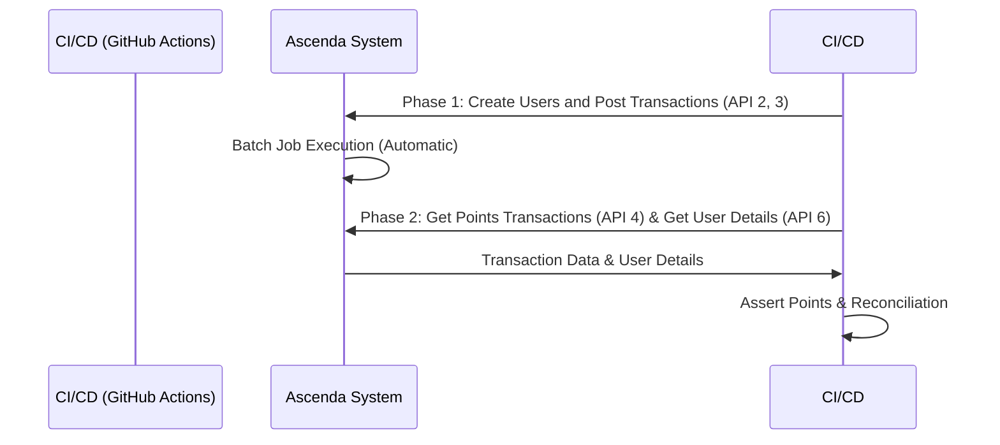
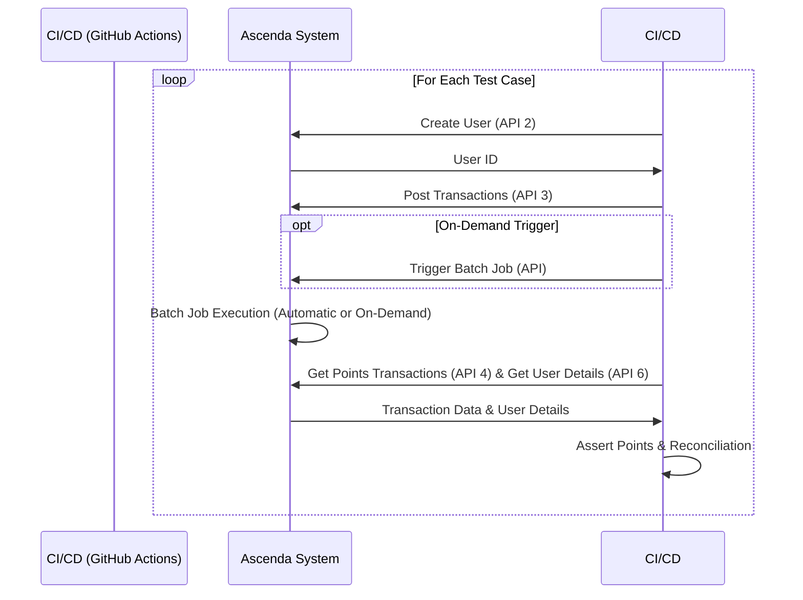

## CI/CD Strategy for Automated Execution of Ascenda Loyalty Point System Test Cases

### **Overview**

This document outlines a comprehensive CI/CD strategy for integrating and automating the execution of Cucumber BDD-based API test cases for the Ascenda Loyalty Point System. The strategy aims to ensure continuous quality assurance throughout the software development lifecycle by incorporating automated testing into the pipeline. The strategy focuses on two primary approaches for test case execution, highlighting their benefits and trade-offs.

### **Integration with GitHub Actions**

GitHub Actions will serve as the CI/CD platform for automating test execution. This choice offers seamless integration with the code repository, streamlined workflows, and a wide range of built-in actions for customization. The following steps detail the integration process:

1. **Test Environment Setup:** A dedicated test environment will be provisioned within GitHub Actions to isolate test runs from production data. This environment will mirror the production system, ensuring test results are reliable.
1. **Workflow Definition:** A GitHub Actions workflow will be defined to orchestrate the test execution process. This workflow will include triggers (e.g., on push to the main branch), actions to set up the test environment, install dependencies, execute the test cases, and report the results.
1. **Dependency Management:** The workflow will manage the installation of necessary dependencies, including Java, Gradle, Cucumber, and any required libraries (e.g., RestAssured, OkHttp).
1. **Test Case Execution:** The workflow will execute the Cucumber test cases against the deployed test environment. Dynamic waits will be incorporated to ensure test execution synchronizes with the batch job completion.
1. **Test Reporting:** Test results will be collected and presented in a structured Allure Report format, including detailed logs and reports. This information will be easily accessible to stakeholders for analysis and decision-making.
1. **Feedback Loop:** The workflow will integrate with communication channels (e.g., Slack, email) to notify relevant team members of test outcomes, including successes, failures, and potential issues.

### **Test Execution Approaches**

Two approaches are proposed for structuring the test cases within the CI/CD pipeline:

1. #### **Two-Phase Testing:** ####
    * Phase 1: Create users and post transactions.
    * Batch Job Execution: Wait for the automatic batch job to complete.
    * Phase 2: Assert points accrual and reconciliation.

2. #### **Independent Test Cases:** (Approach implemented in the assignment) ####
    * Each test case covers the entire cycle: user creation, transactions, batch job wait, and reconciliation.
    * Optionally, trigger the batch job on-demand via an API to reduce wait times.

### **Trade-off Analysis**

| Approach | Advantages | Disadvantages | Recommendation                                                                                                                                            |
| :---- | :---- | :---- |:----------------------------------------------------------------------------------------------------------------------------------------------------------|
| Two-Phase Testing | Efficient; requires waiting for only one batch job cycle. | Test cases are not atomic; complex test data management. | Suitable for simpler scenarios.                                                                                                                           |
| Independent Test Cases | Atomic test cases; easier test data management; more comprehensive test coverage. | Longer execution time due to multiple batch job waits; mitigated by on-demand triggers. | Preferred for complex scenarios. Using parallel execution we can relatively reduce the execution time and optimize on the number of batch job executions. |

### **Continuous Integration (CI)**

* **Frequent Commits:** Encourage developers to commit code frequently to trigger the CI pipeline.
* **Fast Feedback:** Provide quick feedback on test results to developers through GitHub Actions checks and notifications.
* **Test Coverage:** Track test coverage and aim for a high percentage to ensure thorough testing of the system.

### **Continuous Deployment (CD)**

* **Automated Deployment:** Automate the deployment process to staging or production environments based on successful test execution.
* **Environment Promotion:** Use a staged approach (e.g., dev \-\> staging \-\> production) for gradual rollouts and risk mitigation.
* **Monitoring:** Monitor the production environment for issues and collect feedback to drive improvements.

### **Considerations**

* **Batch Job:**
   * **On-Demand Triggering:** If possible, implement an API to trigger the batch job on-demand to reduce test execution time.
   * **Timeout Mechanism:** Implement a timeout mechanism in test cases to prevent indefinite waiting for the batch job.
* **Test Data Management:**
   * **Isolation:** Use unique test data for each test case to avoid conflicts and ensure test independence.
   * **Clean Up:** Consider cleaning up test data after each test case to maintain a clean test environment.
* **Scalability:** Design the CI/CD pipeline to handle an increasing number of test cases as the system grows.
* **Reporting:** Ensure comprehensive test reporting for visibility into test results and trends over time.
* **Maintenance:** Regularly review and update test cases to reflect changes in the system.

### **Conclusion**

The proposed CI/CD strategy, utilizing GitHub Actions and considering two distinct test execution approaches, provides a robust framework for ensuring the quality and reliability of the Ascenda Loyalty Point System. By automating test execution, integrating with the development workflow, and providing comprehensive reporting, this strategy empowers teams to detect and address issues early, leading to a more stable and dependable product. The choice between the two approaches depends on the specific needs and complexity of the test scenarios, offering flexibility to tailor the strategy for optimal results.