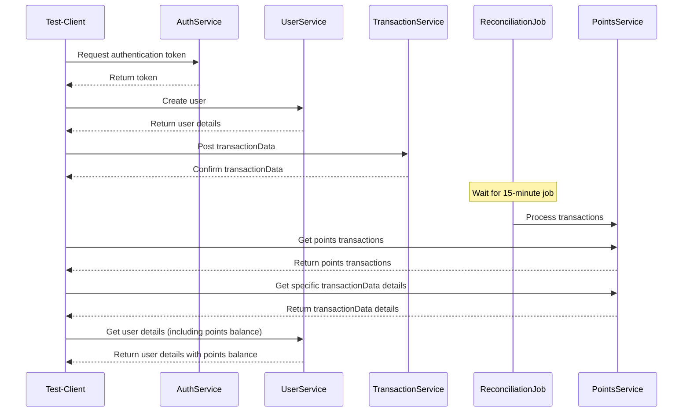

## Test Plan and Strategy for Ascenda Loyalty Point System

### **Overview**

This document outlines the test plan and strategy for the Ascenda Loyalty Point system. The system is a SaaS application that processes and reconciles loyalty points earned through transactions. The primary clients are banks, and the system integrates with their existing systems via APIs. The system processes hundreds of points transactions daily and calculates rewards based on a multiplier of 0.75 per dollar spent.

### **Objectives**

* Validate the correctness and reliability of the points accrual and reconciliation process.  
* Ensure the APIs function as expected and handle errors gracefully.  
* Verify the system can handle the expected volume of transactions.  
* Ensure the system accurately calculates and displays the points balance for users.  
* Verify the security of the system and the protection of user data.

### **Scope**

The following areas are within the scope of this test plan:

* **API Functionality:** Testing all API endpoints to ensure they function correctly as per the provided specifications.  
* **Points Calculation:** Verifying the system correctly calculates points based on the transactionData amount and multiplier.  
* **Points Reconciliation:** Ensuring the system accurately reconciles points and updates user balances.  
* **Data Integrity:** Verifying that transactionData and user data are stored and retrieved correctly.  
* **Performance:** Assessing the system's response time and ability to handle a high volume of transactions.  
* **Security:** Testing for vulnerabilities and ensuring that user data is protected.

### **Out of Scope**

The following areas are out of scope of this test plan:

* **User Interface (UI) Testing:** This test plan focuses on API testing and does not cover UI testing.  
* **Performance Testing under extreme load conditions:** While basic performance will be assessed, comprehensive load testing under extreme conditions is out of scope.  
* **Security penetration testing:** While basic security checks will be performed, in-depth penetration testing is out of scope.

### **Testing Strategy**

### **Sequence Diagram**

#### **API Testing**

* **Positive Testing:** Test API calls with valid input data to ensure they return the expected response and perform the expected action.  
* **Negative Testing:** Test API calls with invalid or unexpected input data to ensure they handle errors gracefully and return appropriate error messages.  
* **Boundary Testing:** Test API calls with input data at the boundaries of acceptable values to ensure they handle edge cases correctly.  
* **Integration Testing:** Test the interaction between different API calls to ensure they work together seamlessly.  
* **API Security Testing:** Test for common vulnerabilities such as SQL injection, cross-site scripting (XSS), and unauthorized access.

#### Points Calculation and Reconciliation Testing

* **Single Transaction Processing:** Test the processing of individual transactions with varying attributes (e.g., different currencies, amounts, international status, merchant categories) to ensure points are calculated correctly based on the 0.75 multiplier. After the scheduled batch job runs, verify that:  
  * The transactionData appears in the Get Points Transactions API with the correct points amount and status "confirmed."  
  * The user's total points balance in the Get User Details API reflects this accrual.  
* **Batch Transaction Processing:** Test the processing of multiple transactions submitted in a sequence, incorporating variations in transactionData attributes. After the batch job runs, verify the following:  
  * **Transaction Order and Details:** Each transactionData appears in the Get Points Transactions API in the order it was submitted, with the correct points amount, status "confirmed," and corresponding transactionData details.  
  * **Incremental Points Balance:** The balance\_as\_of field in the Get Points Transactions API increases cumulatively with each transactionData, accurately reflecting the running total of points earned.  
  * **Final Points Balance:** The final points balance in the Get User Details API matches the total points accumulated across all transactions in the batch.  
* **Points Adjustment (Reversals/Refunds):**  
  * **Transaction Reversals:** Test scenarios where transactions are reversed (e.g., due to returns or disputes). Verify that the corresponding points transactions are reversed or voided in the Get Points Transactions API, and the user's total points balance in the Get User Details API is adjusted accordingly.  
  * **Partial Refunds:** Test scenarios where only a portion of a transactionData is refunded. Ensure that the points adjustment in the Get Points Transactions API and the user's total points balance in the Get User Details API accurately reflect the partial refund amount.  
* **Batch Job:**  
  * **Timing:** Verify that the batch job runs at the specified 15-minute intervals consistently.  
  * **Transaction Processing:** Ensure the batch job correctly processes all pending transactions, transitioning their status from "pending" to "confirmed" and updating points balances.  
  * **Error Handling and Logging:** Monitor logs and system metrics during the batch job to ensure it completes successfully without errors. Verify that any errors encountered during processing are logged appropriately for troubleshooting.  
* **Points Balance Reconciliation:** Conduct regular reconciliation between the points balance in the Get User Details API and the cumulative sum of points transactions in the Get Points Transactions API to ensure consistency and identify any discrepancies.
* 
#### **Performance Testing**

* **Load Testing:** Simulate a high volume of transactions to assess the system's response time and resource utilization.  
* **Stress Testing:** Push the system beyond its expected load to identify its breaking point and how it handles failure.

#### **Test Data**

* **Valid Data:** Use valid user data, transactionData data, and authentication tokens to test positive scenarios.  
* **Invalid Data:** Use invalid or missing data to test negative scenarios and error handling.  
* **Boundary Data:** Use data at the limits of acceptable values to test boundary conditions.  
* **Large Data Sets:** Use large volumes of transactionData data to simulate real-world usage and test performance.

### **Test Environment**

* **Staging Environment:** The tests will be executed in a staging environment that mirrors the production environment as closely as possible.  
* **Test Accounts:** Test user accounts will be created in the staging environment to avoid impacting real user data.

### **Test Deliverables**

* **Test Plan:** This document outlining the testing strategy and approach.  
* **Test Cases:** Detailed test cases covering all identified scenarios.  
* **Test Scripts:** Automated or manual scripts to execute the test cases.  
* **Test Reports:** Reports summarizing the test results, including any defects found.  
* **Defect Reports:** Detailed reports of any defects found during testing, including steps to reproduce and severity.

### **Success and Acceptance Criteria**

* All test cases are executed and pass without critical defects.  
* The system meets the performance requirements under expected load.  
* No security vulnerabilities are discovered.  
* The points accrual and reconciliation process is accurate and reliable.  
* The system handles errors gracefully and provides informative error messages.

This test plan provides a comprehensive strategy for testing the Ascenda Loyalty Point system. By following this plan, we can ensure the system is reliable, secure, and meets the needs of both Ascenda and its clients.